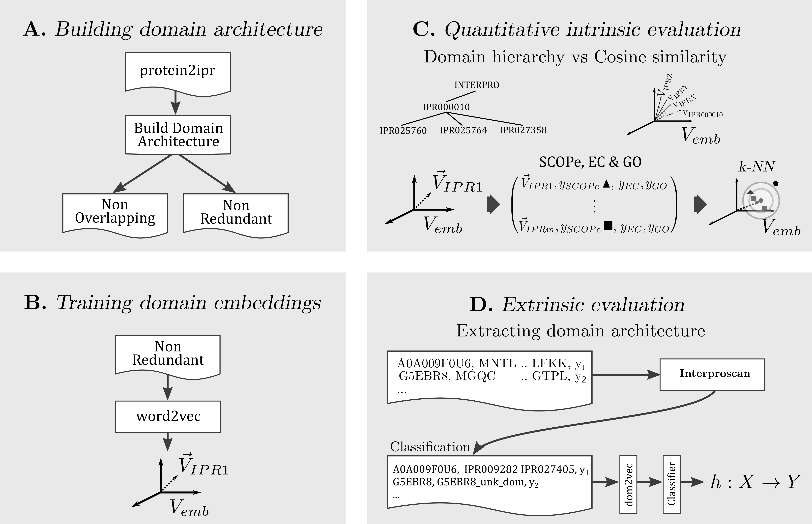

# dom2vec: Protein domain embeddings
Please note: repository in WIP, each folder indicated by WIP will be updated soon.

All protein domains analysis follows the data from [Interpro](https://www.ebi.ac.uk/interpro/) version 75.0.
All data associated can be found at the ftp site for the version 75.0, accessible from the general [download site](https://www.ebi.ac.uk/interpro/download/).
All analysis is decipted in the following image:

## Summary of approach

Summary of the approach/code divided in four parts, building two forms of domain architectures, training domain embeddings, performing intrinsic and extrinsic evaluation of embeddings.

## Main dependencies
Code was executed using a conda environment, of which the full list of dependencies is in conda_env_dependencies.txt.

The main dependencies are listed below:
* Python 3.7.6
* BioPython 1.74
* Gensim 3.8.0
* Pytorch 1.2.0
* Torchtext 0.4.0
* Numpy 1.18.1
* Pandas 1.0.1
* Scikit-learn 0.22.1
* Matplotlib 3.1.1
* Intervaltree 3.0.2
* Treelib 1.5.5

## Build protein domain architectures
0. Data acquisition:

   For Interpro 75.0 version download the files:
* match_complete.xml.gz
* protein2ipr.dat.gz

1. Get protein lengths parsing match_complete.xml:
* change folder/files paths appropriately in [proteinXMLHandler_run.py](code/proteinXMLHandler_run.py)
* run `proteinXMLHandler_run.py`
* prot_id_len tabular file will be created; a sample of the first 100 lines of the full file is saved at [sample file](domain_architecture_creation/prot_id_len_sample_100.tab)

2. Get domains and evidence db id per protein:
* select the output domain annotation **type**: overlap, non overlapping or non redundant. Then set if *GAP* domain is also added to annotations. 
  Change folder/files paths appropriately and uncomment the first section in [main.py](code/main.py) 
* parse domain hits per protein running `main.py`
* id_domains_type.tab file will be created; a sample of the first 100 lines of the full file, for non overlapping with *GAP*, is saved at [sample file](domain_architecture_creation/id_domains_no_overlap_gap_sample_100.tab)

3. Get domain architecture corpus:
* change folder/files paths appropriately and uncomment the first section in [main.py](code/main.py)
* run `main.py`
* domains_corpus_type.txt file will be created; sample of the first 100 line of the full file, for non overlapping with *GAP*, is saved at [sample file](domain_architecture_creation/domains_corpus_no_overlap_gap_sample_100.txt)

## Train protein domain embeddings
0. Needed data:
* the domains_corpus_type.txt from last step

1. Train word2vec model from domain architectures corpus:
* change folder/files paths appropriately in [word2vec_run.py](code/word2vec_run.py)
* change the paths and the training parameters in the provided bash script [run_embs.sh](domain_embeddings_training/run_embs.sh)
* run `run_embs.sh`
* word2vec embedding standard txt file(s) will be created

## Intrinsic evaluation
Data and example running experiments for:
* Domain hierarchy

0. Data acquisition:
   * For Interpro 75.0 version, download the ParentChildTreeFile.txt file

1. Parse the parent child relation:
   * uncomment the domain hierarchy section in [intrinsic_eval_run.py](code/intrinsic_eval_run.py)
   * parse parent child using `parse_parent_child_file()`
   * interpro_parsed_tree.txt will be created; the first 3 Interpro parents of the full parsed tree is saved at [sample file](intrinsic_evaluation/domain_hierarchy/interpro_parsed_tree_sample_3parents.txt)

2. Run evaluation
   * run evaluation with the rest section using the looped `get_nn_calculate_precision_recall_atN()`
   * the outputs will be: average recall value, recall histogram png, diagnostic histogram for parents with recall 0 (if parameter is selected)
   * example outputs can be found respectively at table 1, Figure S1 and S2 in the below bioRxiv manuscript

* SCOPe and EC
0. Data acquisition:
   * For InterPro 75.0 version, download and decompress interpro.xml.gz file

1. Parse interpro.xml:
   * uncomment the EC & SCOPe section in [intrinsic_eval_run.py](code/intrinsic_eval_run.py)
   * parse xml to get available SCOPe and EC labels per domain using `parse_and_save_EC_SCOP()`
   * interpro2EC_SCOPe.tab will be created; a sample of the first 100 lines of the full file is saved at [sample file](intrinsic_evaluation/SCOPe_EC/interpro2EC_SCOPe_sample_100.tab)

2. Run evaluation
   * initialize `EC_SCOP_Evaluate()` class for evaluation using EC or SCOPe
   * run evaluation with the rest section using the looped `run_classification()`
   * average test accuracy over 5-fold cross validation will be printed; example values can be found in Tables 2 and 3 in the below bioRxiv manuscript

* GO molecular function
0. Data acquisition:
   * For Interpro 75.0 version, download the interpro2go file and add the suffix .txt

For each **organism**: malaria, ecolik12, yeast, human follow the steps:
1. Parse interpro2go.txt:
   * uncomment the GOEvaluate section in [intrinsic_eval_run.py](code/intrinsic_eval_run.py)
   * parse the txt file using `convert_go_labels()` producing:
   * interpro2go_organism_MF.tab containing unprocessed available GO MF labels per domain; a sample of the first 100 lines of the full file for *yeast* is saved at [sample file](intrinsic_evaluation/GO_molecular_function/interpro2go_yeast_MF_sample_100.tab)
   * interpro2go_yeast_MF_labels.csv containing GO MF labels after abstracting them; a sample of the first 100 lines of the full file for *yeast* is saved at [sample file](intrinsic_evaluation/GO_molecular_function/interpro2go_yeast_MF_labels_sample_100.csv)

2. Run evaluation
   * initialize `GOEvaluate()` class for evaluation in selected organism
   * run evaluation with the rest section using the looped `run_classification()`
   * average test accuracy over 5-fold cross validation will be printed; example can be found in Table 4 in the below bioRxiv manuscript
 
## Downstream evaluation
0. Extract non-redundant domains from proteins in data set
   * match protein id to the tabular file with domain architectures, result of step 2 of [building domain architectures](https://github.com/damianosmel/dom2vec#build-protein-domain-architectures),
   to get domains for each protein as shown in [fasta2csv](https://github.com/damianosmel/dom2vec/blob/7a8de7994220d33577b31f74cf37ea5ed675c85b/code/extrinsic_eval_run.py#L253)
1. For the remaining proteins, run intreproscan and convert annotation to selected type of domain annotation:
   * install interproscan as discussed in [interProScan Wiki](https://github.com/ebi-pf-team/interproscan/wiki)
   * run interproscan with data set proteins as input, the output is a tsv file
   * gzip the tsv and parse as in [parse_prot2in](https://github.com/damianosmel/dom2vec/blob/7a8de7994220d33577b31f74cf37ea5ed675c85b/code/main.py#L127), the output is a tabular file (same columns as of the previous step tabular file)
   * run again the fasta2csv in [fasta2csv after interproscan](https://github.com/damianosmel/dom2vec/blob/7a8de7994220d33577b31f74cf37ea5ed675c85b/code/extrinsic_eval_run.py#L258)
2. For the rest of protein without identified domains created a default domain per protein as shown in [fasta2default](https://github.com/damianosmel/dom2vec/blob/7a8de7994220d33577b31f74cf37ea5ed675c85b/code/main.py#L134)
   * update data set protein domains running fasta2csv for last time, as shown in [fasta2csv after default domains](https://github.com/damianosmel/dom2vec/blob/7a8de7994220d33577b31f74cf37ea5ed675c85b/code/extrinsic_eval_run.py#L267)

3. Preprocess data sets for learning:
   * split train and test
   * create inner cross validation from the training set
   as shown in [create data set splits](https://github.com/damianosmel/dom2vec/blob/7a8de7994220d33577b31f74cf37ea5ed675c85b/code/extrinsic_eval_run.py#L277)

Data and example code to run cross validation and performance experiments for three data sets:
* TargetP
* Toxin
* NEW
are found at the downstream evaluation [folder](https://github.com/damianosmel/dom2vec/tree/master/downstream_evaluation)

## Pretrained dom2vec
Pretrained dom2vec embeddings can be downloaded from the Research Data portal of Leibniz University Hannover at [dom2vec_pretrained](https://data.uni-hannover.de/dataset/dom2vec_pretrained).

## Citation
This repository is the implementation of the research work: "*Capturing Protein Domain Structure and Function Using Self-Supervision on Domain Architectures*" [link](https://www.mdpi.com/1999-4893/14/1/28).

Cite as:
```
Melidis, D.P.; Nejdl, W. Capturing Protein Domain Structure and Function Using Self-Supervision on Domain Architectures.
Algorithms 2021, 14, 28. https://doi.org/10.3390/a14010028
```
